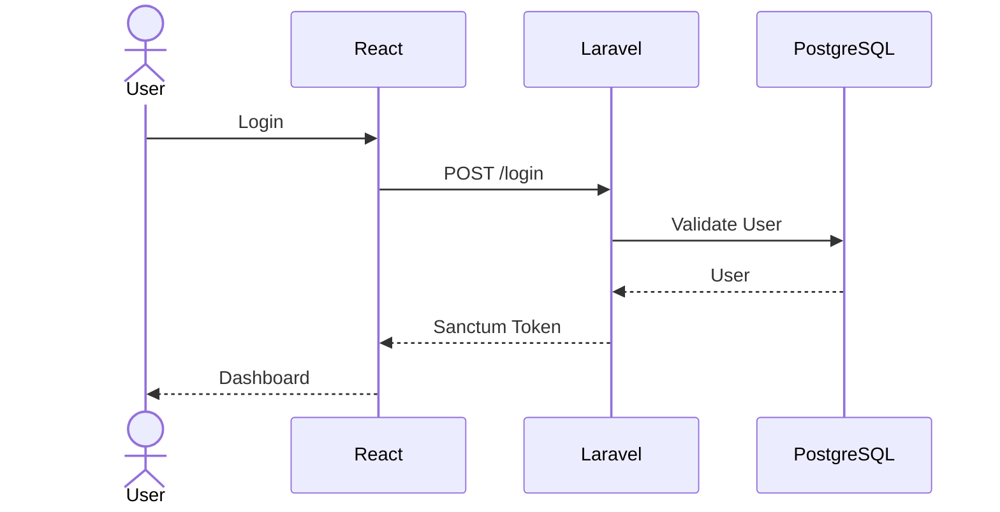

# System Architecture

# Human Resource Information System (HRIS)

Version : 1.0.0

---

# 1. Overview

HRIS System merupakan aplikasi berbasis web yang dibangun menggunakan arsitektur client-server dengan pendekatan REST API.

Frontend dan backend dikembangkan secara terpisah sehingga memudahkan proses maintenance, scaling, dan deployment.

---

# 2. Architecture Diagram

```mermaid
flowchart LR

User((User))

subgraph Frontend
React["React + TypeScript + Vite"]
end

subgraph Backend
Laravel["Laravel REST API"]
Sanctum["Laravel Sanctum"]
Spatie["Spatie Permission"]
end

subgraph Database
PostgreSQL[(PostgreSQL)]
end

subgraph Storage
Storage["Storage / PDF"]
end

User --> React

React --> Laravel

Laravel --> Sanctum

Laravel --> Spatie

Laravel --> PostgreSQL

Laravel --> Storage
```

---

# 3. System Components

## Frontend

Technology

- React
- TypeScript
- Vite
- Tailwind CSS
- shadcn/ui

Responsibilities

- User Interface
- Form Validation
- State Management
- API Communication
- Authentication Handling

---

## Backend

Technology

- Laravel 12
- PHP 8.4

Responsibilities

- Business Logic
- Authentication
- Authorization
- Payroll Calculation
- PDF Generation
- REST API

---

## Database

Technology

- PostgreSQL

Responsibilities

- Store Master Data
- Store Employee Data
- Store Payroll
- Store Payslip Information

---

## Storage

Responsibilities

- Store Payslip PDF
- Employee Documents (Future)

---

# 4. Authentication Flow



---

# 5. Authorization

Role & Permission menggunakan package:

Spatie Laravel Permission

Role yang tersedia:

- Super Admin
- HR
- Payroll
- Employee

Permission diberikan berdasarkan role sehingga setiap pengguna hanya dapat mengakses menu sesuai hak aksesnya.

---

# 6. Module Architecture

```
Authentication
│
├── Login
├── Logout
└── Profile

Master Data
│
├── Department
├── Position
└── Employee

Payroll
│
├── Payroll
├── Payroll Detail
└── Payslip

Dashboard
│
├── Statistics
├── Charts
└── Recent Payroll
```

---

# 7. Request Flow

```mermaid
flowchart LR

Browser

↓

React

↓

Axios

↓

Laravel API

↓

Service Layer

↓

Repository

↓

PostgreSQL

↓

Response JSON

↓

React UI
```

---

# 8. Backend Layer

```
Controller

↓

Request Validation

↓

Service

↓

Repository

↓

Model (Eloquent)

↓

Database
```

Penjelasan:

- Controller menerima request dari frontend.
- Form Request melakukan validasi data.
- Service berisi business logic.
- Repository mengakses database.
- Model menggunakan Eloquent ORM.

---

# 9. Frontend Structure

```
pages/
components/
layouts/
hooks/
services/
types/
utils/
routes/
```

Penjelasan:

- pages → Halaman aplikasi
- components → Komponen yang dapat digunakan kembali
- layouts → Layout aplikasi
- hooks → Custom React Hooks
- services → API Service (Axios)
- types → TypeScript Interface
- utils → Helper Function
- routes → Routing

---

# 10. Security

Authentication

- Laravel Sanctum

Authorization

- Spatie Laravel Permission

Validation

- Laravel Form Request

Password

- Hash (Bcrypt)

API

- Protected Middleware

CORS

- Configured

---

# 11. Deployment Architecture

```mermaid
flowchart LR

Internet

↓

Nginx

↓

Laravel API

↓

PostgreSQL

Laravel API --> Storage
```

---

# 12. Future Architecture

Versi berikutnya akan mendukung:

- Attendance Module
- Leave Management
- Overtime
- BPJS Calculation
- Tax Calculation
- Email Notification
- Multi Branch
- Multi Company
- Audit Log
- Redis Cache
- Queue Worker