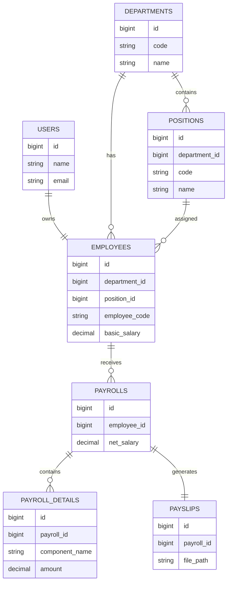

# Entity Relationship Diagram

```mermaid
erDiagram

USERS ||--|| EMPLOYEES : owns

DEPARTMENTS ||--o{ POSITIONS : contains

DEPARTMENTS ||--o{ EMPLOYEES : has

POSITIONS ||--o{ EMPLOYEES : assigned

EMPLOYEES ||--o{ PAYROLLS : receives

PAYROLLS ||--o{ PAYROLL_DETAILS : contains

PAYROLLS ||--|| PAYSLIPS : generates

USERS {
bigint id
string name
string email
}

DEPARTMENTS {
bigint id
string code
string name
}

POSITIONS {
bigint id
bigint department_id
string code
string name
}

EMPLOYEES {
bigint id
bigint department_id
bigint position_id
string employee_code
decimal basic_salary
}

PAYROLLS {
bigint id
bigint employee_id
decimal net_salary
}

PAYROLL_DETAILS {
bigint id
bigint payroll_id
string component_name
decimal amount
}

PAYSLIPS {
bigint id
bigint payroll_id
string file_path
}
```