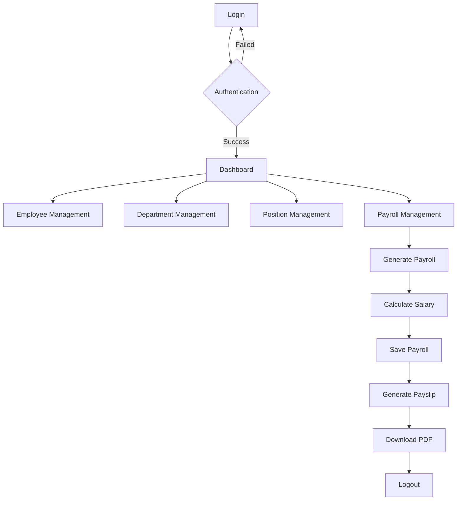
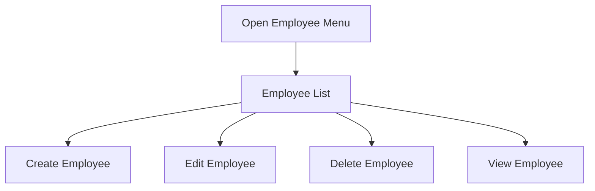
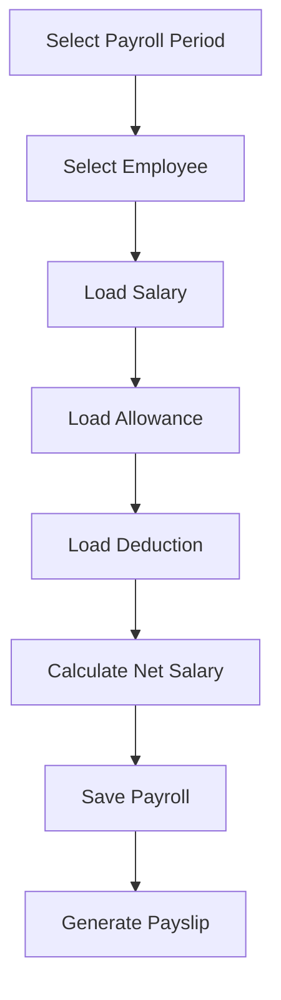

# Flowchart

## HRIS Main Business Flow

```mermaid
flowchart TD

A[Login] --> B{Authentication}

B -->|Success| C[Dashboard]

B -->|Failed| A

C --> D[Employee Management]

C --> E[Department Management]

C --> F[Position Management]

C --> G[Payroll Management]

G --> H[Generate Payroll]

H --> I[Calculate Salary]

I --> J[Save Payroll]

J --> K[Generate Payslip]

K --> L[Download PDF]

L --> M[Logout]
```

---

## Employee Management

```mermaid
flowchart TD

A[Open Employee Menu]

A --> B[Employee List]

B --> C[Create Employee]

B --> D[Edit Employee]

B --> E[Delete Employee]

B --> F[View Employee]
```

---

## Payroll Process

```mermaid
flowchart TD

A[Select Payroll Period]

A --> B[Select Employee]

B --> C[Load Salary]

C --> D[Load Allowance]

D --> E[Load Deduction]

E --> F[Calculate Net Salary]

F --> G[Save Payroll]

G --> H[Generate Payslip]
```