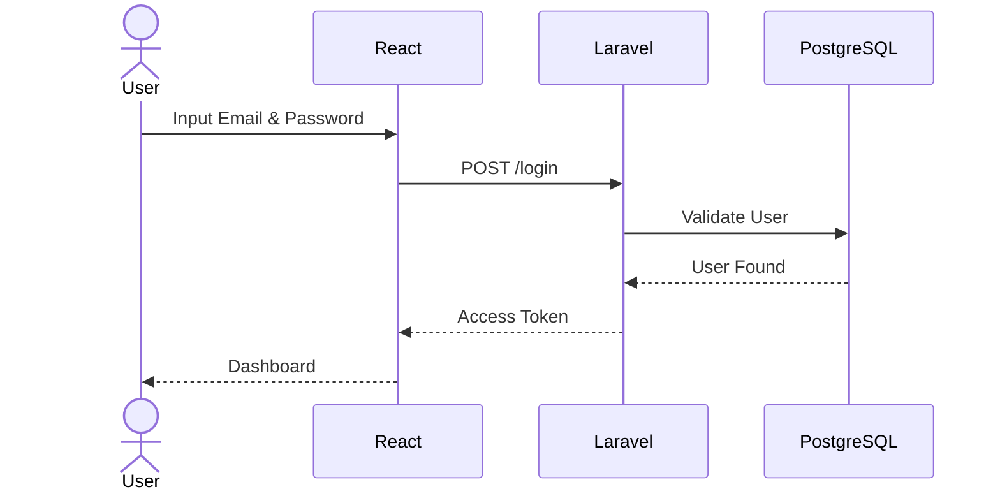
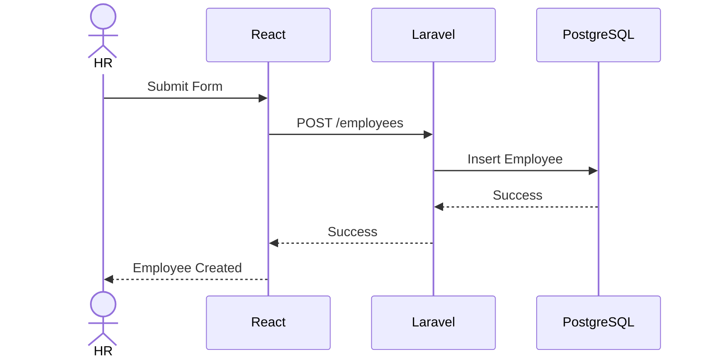
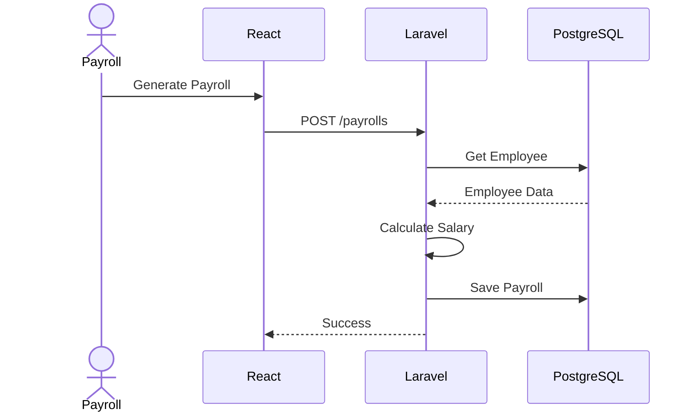
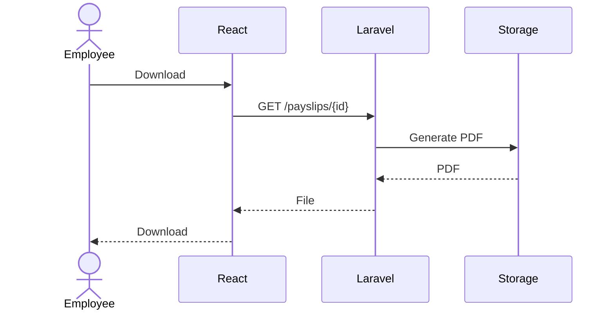

# Sequence Diagram

## Login

```mermaid
sequenceDiagram

actor User

participant React

participant Laravel

participant PostgreSQL

User->>React: Input Email & Password

React->>Laravel: POST /login

Laravel->>PostgreSQL: Validate User

PostgreSQL-->>Laravel: User Found

Laravel-->>React: Access Token

React-->>User: Dashboard
```

---

## Create Employee

```mermaid
sequenceDiagram

actor HR

participant React

participant Laravel

participant PostgreSQL

HR->>React: Submit Form

React->>Laravel: POST /employees

Laravel->>PostgreSQL: Insert Employee

PostgreSQL-->>Laravel: Success

Laravel-->>React: Success

React-->>HR: Employee Created
```

---

## Generate Payroll

```mermaid
sequenceDiagram

actor Payroll

participant React

participant Laravel

participant PostgreSQL

Payroll->>React: Generate Payroll

React->>Laravel: POST /payrolls

Laravel->>PostgreSQL: Get Employee

PostgreSQL-->>Laravel: Employee Data

Laravel->>Laravel: Calculate Salary

Laravel->>PostgreSQL: Save Payroll

Laravel-->>React: Success
```

---

## Download Payslip

```mermaid
sequenceDiagram

actor Employee

participant React

participant Laravel

participant Storage

Employee->>React: Download

React->>Laravel: GET /payslips/{id}

Laravel->>Storage: Generate PDF

Storage-->>Laravel: PDF

Laravel-->>React: File

React-->>Employee: Download
```